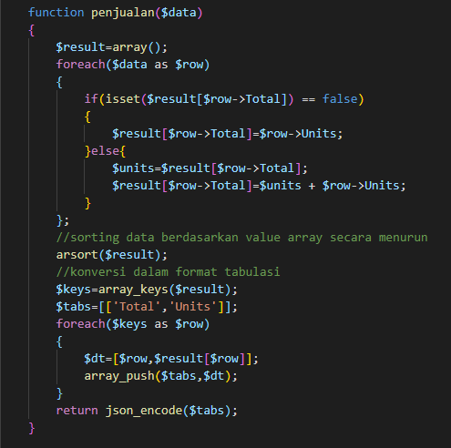
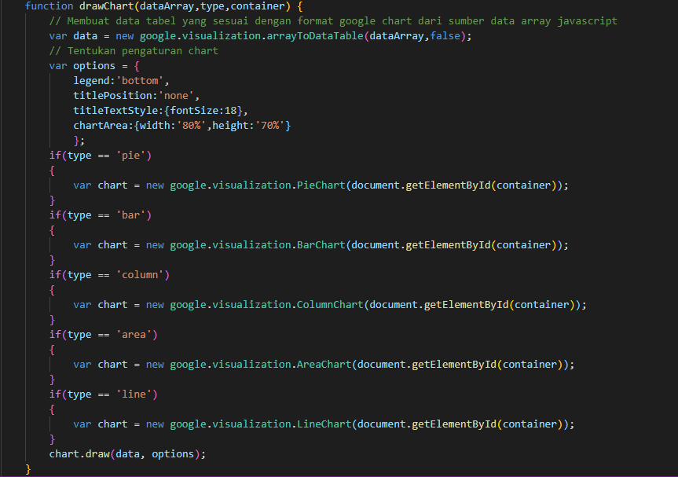
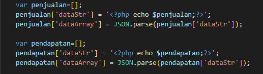
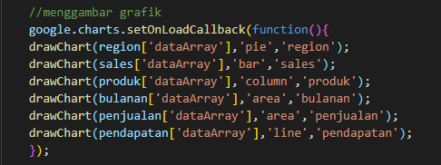
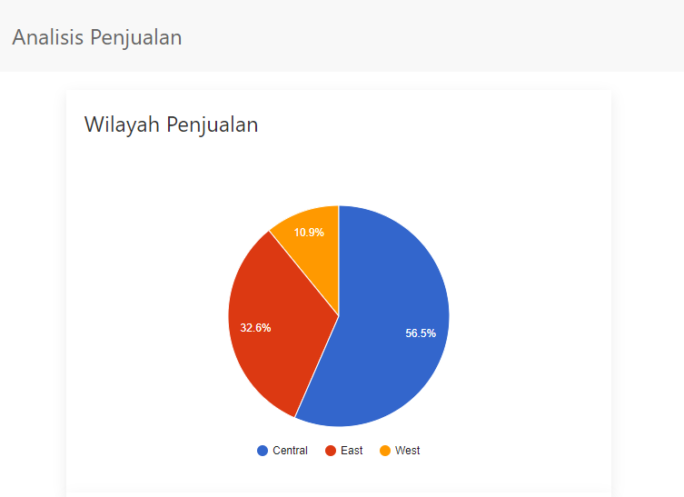
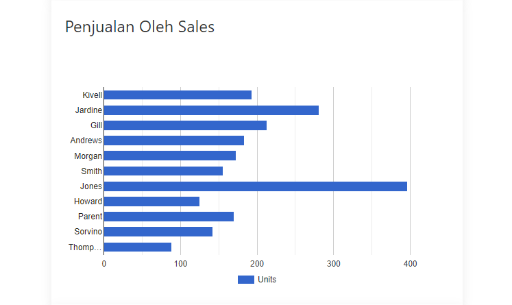
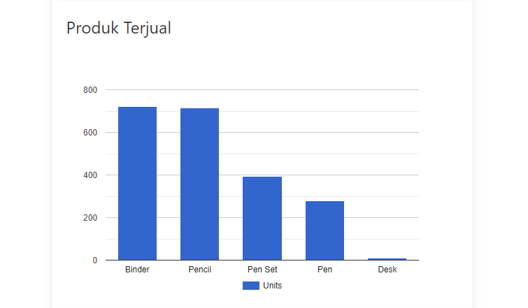
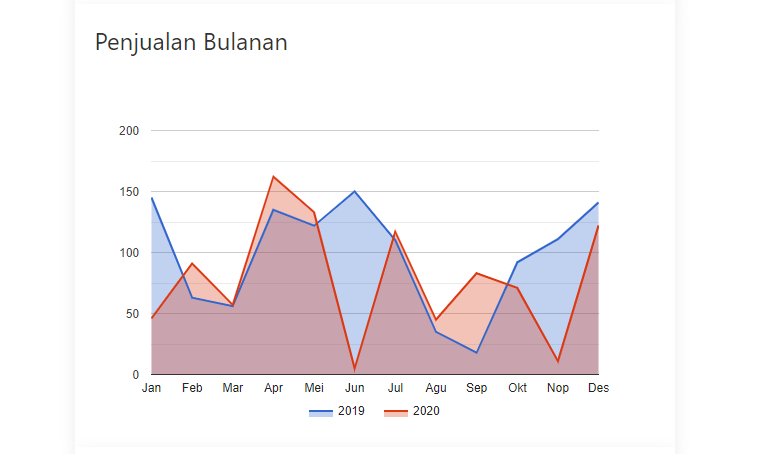
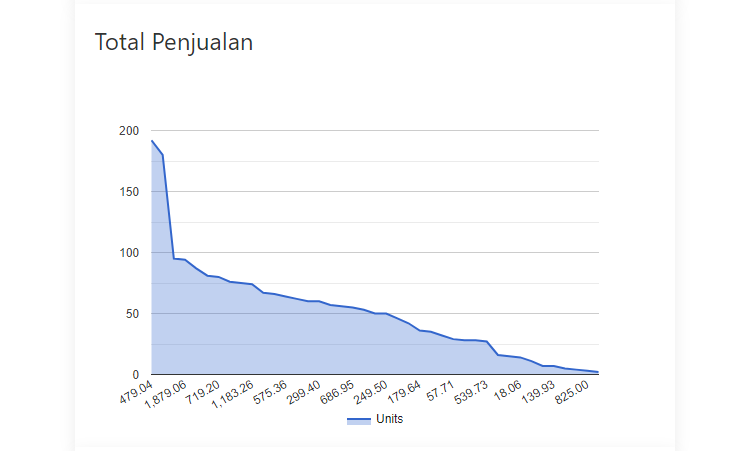
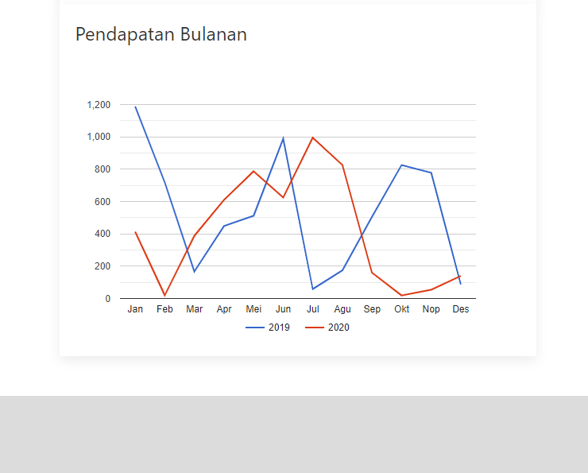

# Visualisasi-informasi (UTS)
Visualisasi data dilihat oleh banyak bidang ilmu sebagai komunikasi visual modern. Visualisasi data adalah teknik menyajikan data secara visual melalui grafik, chart, peta dengan tujuan informasi tetap informatif dengan tampilan yang menarik dan mudah dipahami. Visualisasi data dapat menggambarkan relasi dan pola antara variabel yang ada dalam data. Tujuan pokok visualisasi data ialah untuk mengomunikasikan informasi secara jelas dan efektif melalui sarana grafis

## Manfaat Visualisasi Data
1. Mengkomunikasikan informasi secara jelas dan efisien kepada pengguna lewat grafik informasi
2. Membantu pengguna dalam menganalisis dan penalaran tentang data dan bukti
3. Membuat data yang kompleks bisa diakses, dipahami dan berguna
4. Menghasilkan Komunikasi yang Efektif
5. Pengambilan Keputusan Lebih Mudah

## Framework yang digunakan pada visualisasi data ini adalah:
1. Codeigniter v3.x.x (PHP Framework)
2. Uikit v3.x.x (UI Framework)
3. Google Charts (Visualization Framework)

## Tahapan Visualisasi

### 1. Menentukan data row yang akan kita olah.
Data row merupakan sekumpulan baris data yang memuat beberapa variabel informasi. Tabel dibawah ini merupakan contoh data row. Data row dapat berasal dari satu atau beberapa tabel dalam sql, misalnya, atau berasal dari sumber lain misalnya API sebuah sistem atau file excel. Tahap pertama yang harus kita siapkan dalam visualisasi data adalah memastikan bahwa data yang kita miliki sudah dalam bentuk terstruktur dalam baris data.

### 2. Menyusun problem statement.
Data row pada poin 1 memuat variabel gender, semester, dan ipk untuk mahasiswa dengan nim tertentu. Tabel tersebut sudah memiliki informasi, misalnya, mahasiswa dengan nim 0786373 adalah laki-laki yang sedang menempuh semester 3 dan memiliki IPK 3.25. Tetapi data tersebut belum memiliki informasi secara menyeluruh yang dapat memberikan pengetahuan tertentu. Oleh sebab itu kita perlu untuk menyusun problem statemen yang dapat menggambarkan informasi apa saja yang akan disampaikan kepada pengguna.

### 3. Membuat data tabel dalam format cross tabulation.
Langkah berikutnya adalah menyusun cross tabulation berdasarkan baris data dan problem statement. Satu probem statement akan menghasilkan satu cross tabulation. Mungkin tahap ini akan memerlukan algoritma untuk membuat data row menjadi format cross tabulation yang kita inginkan.

### 4. Menentukan teknik visualisasi.
Teknik visualisasi merupakan bentuk visual yang digunakan untuk menampilkan data. Secara umum teknik visualisasi terdiri dari Pie Chart (diagram lingkaran), Bar Chart (diagram batang), line chart (diagram garis), atau gabungan antara bar chart dan line chart. Pada tahap ini, kita menganisa teknik yang tepat untuk setiap cross tabulation yang sudah dibuat pada tahap sebelumnya.

### 5. Menentukan layout.
Tahap layouting merupakan tahap menentukan posisi dari setiap visualisasi pada layar utama visualisasi agar pengguna dapat menerima sejumlah besar informasi sekaligus. Oleh sebab itu halaman visualisasi sebaiknya merupakan single page sehingga aspek penyampaian informasi secara sekaligus dapat terpenuhi.

### Berdasarkan data row yang sudah kita peroleh, problem statement dapat kita susun. Problem statement yang mungkin diperoleh dari data row terebut diantaranya adalah:
1. Bagaimana data penjualan berdasarkan region.
2. Bagaimana data penjualan berdadarkan sales.
3. Bagaimana data penjualan berdasarkan produk.
4. Bagaimana data penjualan berdasarkan bulan di tahun tertentu.
5. Bagaimana data total penjualan berdasarkan units.
6. Bagaimana pendapatan penjualan bulanan.

## Algoritma Konversi
Berdasarkan format data json yang ada, kita perlu untuk mengkonversi sehingga menjadi tabulasi yang diharapkan. Ikuti algoritma berikut untuk membuatnya:
1. Buatlah variabel array C.
2. Lakukan perulangan untuk setiap data.
3. Jika belum terdapat region yang sama didalam C simpan variabel region dan unit.
4. Jika terdapat region yang sama dalam C maka jumlahkan unit.

Algoritma diatas kita konversi dalam PHP. Untuk membuat visualisasi penjualan baru, update file controllers/Visin.php dengan melakukan prosedur konversi sehingga fungsi region() menjadi seperti kode berikut:

Selanjutnya update kode Javascript yang ada pada file view/visin.php menjadi seperti berikut ini:

Kode di atas menunjukkan bahwa proses menggambar grafik dilakukan oleh fungsi drawChart(dataArray,type,container). Teknik ini dipakai untuk mengurangi penulisan kode secara berulang. Parameter pada fungsi drawChart() diantaranya adalah:
### dataArray
Data dalam format Array yang diperoleh dari hasil parsing data yang diperoleh dari variabel PHP. Proses parsing data dilakukan menggunakan Javascript menggunakan fungsi JSON.parse().

### type
Tipe chart yang digunakan (‘pie', ‘bar', ‘column', 'line', 'area')

### container
Nama id dari elemen yang akan digunakan sebagai container grafik. 

    ...
    drawChart(region['dataArray'], 'pie','region');
    ...

Untuk menambah suatu grafik visualisasi lagi, Kita perlu menyusun layout dalam Codeigniter yang kita buat Update file pada views > visin.php menjadi seperti kode berikut:

Untuk membuat visualisasi penjualan baru, update file controllers/Visin.php seperti berikut:

Update juga pada file view/visin.php menjadi seperti kode berikut:
 

## Tampilan Akhir:

